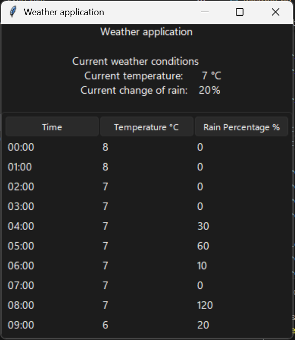

This Python application is made using Tkinter and makes use of the Open Meteo weather api.

## **Key takeaways**
- This application makes use of a Tkinter GUI interface to display current weather information
- A .env file is used to ensure sensitive data is not uploaded when commiting this project to GitHub
- This application makes use of an API which is used to retrieve data

