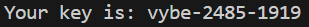
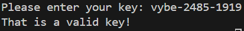

A python script which generates a key and another script which checks the validity of the key.

## **How it works**
The key is generated following a pattern and the checker checks the pattern is being followed. The current implentation uses a step to generate the first section of the key. It chooses a letter at random and uses a step of 3 to select the next letter. The next step is to randomly select 4 numbers and use this to generate the second section. The final section is generated using the total of the previously generated 4 numbers. The key validation section reverses this rule to check the given key follows the rules used to generate a valid key.

