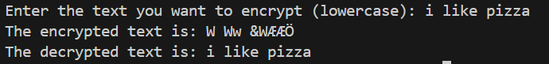

A python encryption algorithms which takes inspiration from the Feistel network. 

## **How it works**
To encrypt text, the first step is to split the string into character substrings.  
The substrings are then firstly passed through a ceasur cipher which makes use of the string length for the step.  
The next step is to convert each character into its relevant ASCII value and then represent it in its binary format. During the binary conversion, if the binary value is less than 8 digits (00001111), then 0s are added to the front to make it 8 digits.  
After converting to binary, the front half (0000) and the back half (1111) are then swapped.  
The two halves are then put back together, converted back to integer value and back to a character forming the encrypted text.  

## **Screenshot**

## **Limitations**
- This encryption method is in no way secure and should not be used for encrypting important information, this was simply created as an exercise to develop my skills.  
- If you do not have the original length of the string, you won't be able to reverse the cipher correctly. While you can get the length from the new encrypted string, this would mean either storing the length or the user remembering the length, both of which are insecure.

## **Further developments**
Implenting a simple recurrsion method onto this would make the system a lot more secure.  
If you are planning to use this as a password encryption technique for a SAAS, an improvement would be to add a salt onto the string and also to hash the encrypted outcome before storage.
